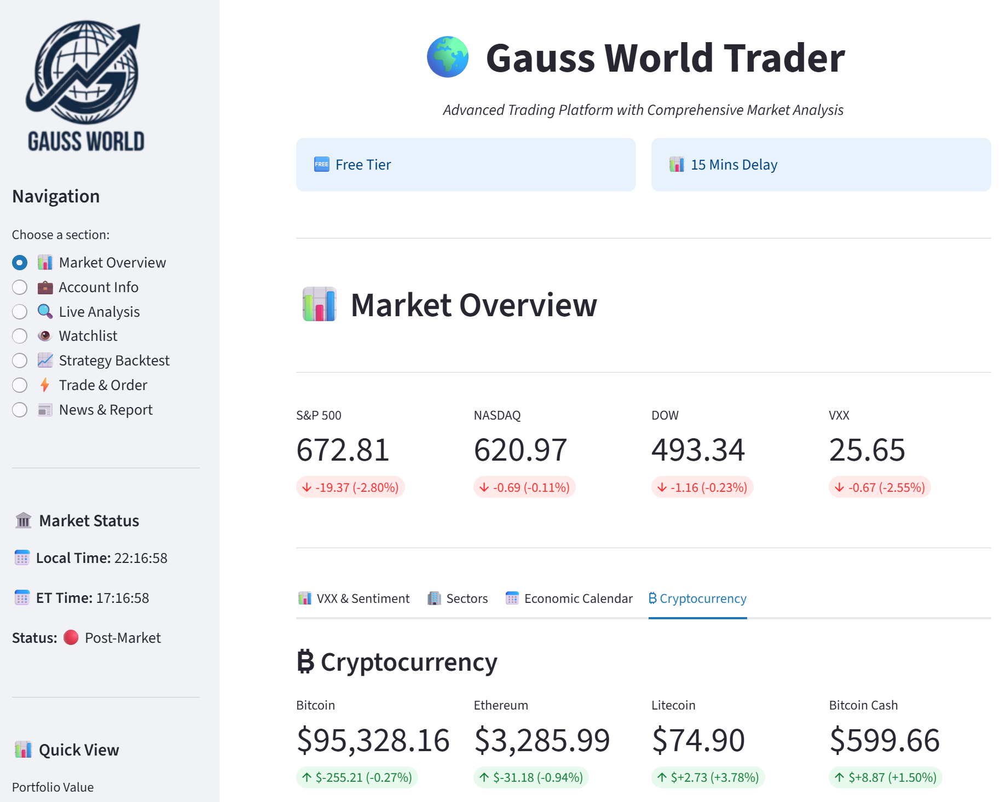
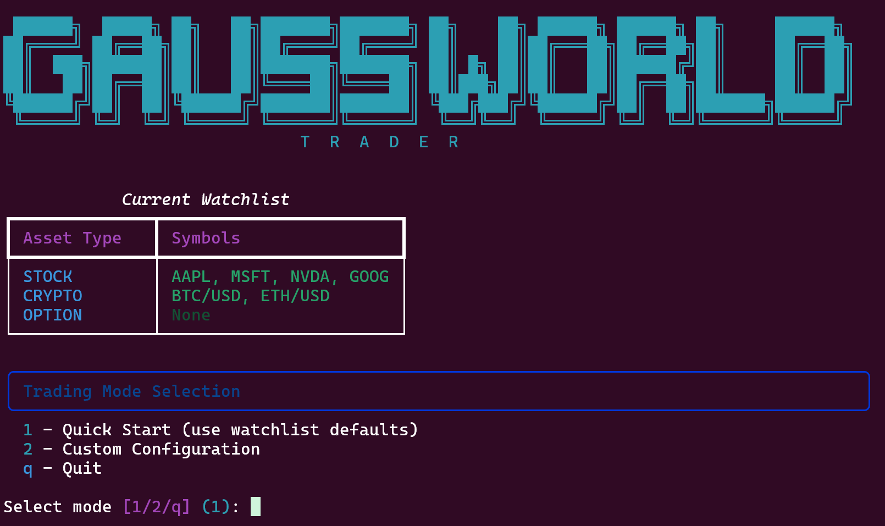

<div align="center">
  
  <p>
    
    
    
    
    <a href="https://join.slack.com/t/gaussianprocessmodels/shared_invite/zt-5acinu03-qvIOXiqSX0tvQmwPL2D7Nw">
      
    </a>
  </p>
  <p>
    <strong>Gauss World Trader</strong> — <em>A high-performance, Python 3.12+ optimized
    algorithmic trading platform featuring modern async operations, intelligent data
    feeds, multi-agent analysis, and advanced portfolio management.</em>
  </p>
  <p>
    <strong>Named after Carl Friedrich Gauss</strong>, who revolutionized statistics and probability theory — the foundations of modern quantitative finance.
  </p>
</div>

---

## 📖 What is Algorithmic Trading?

Algorithmic trading (also called algo trading or automated trading) uses computer programs to execute trades based on predefined rules and strategies. Instead of manually watching charts and clicking buy/sell buttons, algorithms analyze market data and make trading decisions automatically.

**Key concepts:**
- **Automated Execution** — Trades happen without manual intervention once rules are set
- **Speed & Efficiency** — Computers can process data and execute orders faster than humans
- **Emotion-Free Trading** — Algorithms follow rules consistently without fear or greed
- **Backtesting** — Strategies can be tested on historical data before risking real money

Algorithmic trading is used by individual traders, hedge funds, and institutions worldwide to implement strategies ranging from simple moving average crossovers to complex statistical arbitrage.

---

## 🌐 What is GaussWorldTrader?

GaussWorldTrader is an open-source algorithmic trading platform designed for both learning and practical use.

- **Multiple Asset Classes** — Trade stocks, cryptocurrencies, and options through a unified interface
- **Pre-built Strategies** — Ready-to-use strategies including momentum, value investing,
  trend following, multi-agent trading, and more
- **Educational Foundation** — Clear code structure and documentation to help you understand how trading systems work
- **Real-time & Backtesting** — Test strategies on historical data or run them live with paper or real money
- **Modern Architecture** — Built with Python 3.12+ using async patterns for efficient data processing

Whether you're a beginner learning about markets or an experienced trader building custom strategies, GaussWorldTrader provides the tools and framework to get started.

---

## 🏁 How to Start GaussWorldTrader

**Step 1: Set Up Your Environment**
- Install Python 3.12 or higher on your system
- Clone the repository and install the required dependencies
- Create your `.env` file with API keys (see Configuration section below)

**Step 2: Get API Access**
- Sign up for an [Alpaca](https://alpaca.markets/) account (free) for trading and market data
- Obtain API keys from [Finnhub](https://finnhub.io/) and [FRED](https://fred.stlouisfed.org/) for additional data sources

**Step 3: Choose Your Interface**
- **Dashboard** — Launch the web-based Streamlit interface for visual analysis and monitoring
- **CLI** — Use the command-line interface for scripting and automation
- **Live Trading CLI** — Use the unified interactive CLI for live trading sessions

**Step 4: Start with Paper Trading**
- Always begin with Alpaca's paper trading mode to test strategies without risking real money
- Run backtests on historical data to understand strategy performance
- Monitor results and adjust parameters before considering live trading

**Step 5: Explore and Learn**
- Review the built-in strategies to understand different trading approaches
- Study the codebase structure to learn how trading systems are designed
- Join the Slack community to ask questions and share ideas

---

## ✨ Features

- **🚀 Modern Async Architecture** — Built for Python 3.12+ with async/await patterns
- **📊 Multiple Trading Strategies** — Momentum, Value, Trend Following, Statistical Arbitrage, and more
- **📈 Real-time Dashboard** — Interactive Streamlit interface for monitoring and analysis
- **Strategy and Execution Layers** — Signals and plans live in strategies; sizing and orders live in execution
- **💼 Portfolio Management** — Advanced position tracking and risk management
- **🔌 Multi-source Data Feeds** — Alpaca, Finnhub, FRED, and News integrations
- **🤖 Multi-Agent Trading** — Committee-style stock analysis with `fast` and `llm` modes
- **🧪 Vectorbt Backtests** — Stock and crypto backtests run through `vectorbt`; options stay on the legacy path
- **🧩 Options Multi-Leg Orders** — `TradingOptionEngine` supports MLEG submissions
- **🧮 Options Vertical Spreads** — IV/greeks-filtered bull/bear call/put spreads via multi-leg orders

---

## Architecture: Strategy -> Plan -> Execution

- **Strategy layer** builds indicators and signals in `get_signal()`, then maps them to an abstract
  `ActionPlan` in `get_action_plan()` (target price, stop loss, take profit, intent).
- **Execution layer** (`ExecutionEngine`) turns an `ActionPlan` into concrete orders: sizes quantity,
  enforces account limits (fractional, shorting, margin), and applies order type policy.
- **Live trading** runs on `live_trading_*.py` using the execution layer.
- **Backtesting** uses `vectorbt` for stock and crypto strategies and keeps the legacy engine for
  option strategies.
- **Dashboard analysis** can run the multi-agent stock strategy directly and render agent reports,
  risk assessment, debate output, and usage metadata.

Order type default (`auto`): if a plan provides a target price, a limit order is used (price improved by
the minimum tick); otherwise a market order is used. Sell-to-open is disabled by default and only used
when the user opts in and the account supports margin + shorting.

---

## 🚀 Quick Start

```bash
# Clone the repository
git clone https://github.com/Magica-Chen/GaussWorldTrader.git
cd GaussWorldTrader

# Create environment (Python 3.12+ required)
conda create -n gaussworldtrader python=3.12
conda activate gaussworldtrader

# Install dependencies
pip install -r requirements.txt

# Configure API keys
cp .env.example .env

# Run the dashboard
python dashboard.py

# Or use the CLI
python main_cli.py list-strategies
```

---

## 🎯 Entry Points

| Entry Point | Command | Description |
|-------------|---------|-------------|
| **CLI** | `python main_cli.py` | Typer-based command-line interface for scripting and automation |
| **Dashboard** | `python dashboard.py` | Interactive Streamlit web interface at `http://localhost:3721` |
| **Live Trading CLI** | `python live_script.py` | Unified interactive live trading menu |

 

### CLI Examples

```bash
python main_cli.py list-strategies              # List all available strategies
python main_cli.py run-strategy --strategy momentum AAPL MSFT --days 90
python main_cli.py backtest --strategy mean_reversion AAPL --days 365
python main_cli.py backtest --strategy multi_agent AAPL --days 120 -p mode=fast
python main_cli.py backtest --strategy trend_following AAPL --days 365 --walk-forward --splits 4
python main_cli.py account-info                 # View account details
python main_cli.py stream-market --asset-type crypto --crypto-loc eu-1 --symbols BTC/USD,ETH/USD
```

---

## 🛰️ Live Trading

```bash
# Launch unified interactive CLI
python live_script.py
```
 

The unified CLI provides:
- **Quick Start** — Trade all asset types with watchlist defaults
- **Custom Configuration** — Select asset types, symbols, strategies, and parameters interactively

**Strategy Selection by Asset Type:**
| Asset Type | Available Strategies |
|------------|---------------------|
| Stock | momentum, mean_reversion, macro_factor, multi_agent, value, trend_following, scalping, statistical_arbitrage |
| Crypto | crypto_momentum, btc_volatility_breakout |
| Option | wheel |

Note: `crypto_momentum` is the unified MomentumStrategy configured with crypto defaults.

Notes:
- Multi-symbol runs share a single websocket per asset type to stay within Alpaca connection limits.
- Due to Alpaca connection limits, multiple asset types run sequentially (press Ctrl+C to advance).
- Stock and option engines check market hours before trading.
- Defaults are pulled from `watchlist.json` + current positions for each asset type.
- Live trading checks account capabilities up front; fractional/shorting prompts appear only when supported.
- Sell-to-open remains disabled unless the user explicitly enables it.
- Choosing `multi_agent` in the live stock CLI now prompts for `fast` or `llm` mode before startup.
- `fast` mode avoids LLM calls and is the safer default for routine live paper-trading tests.

---

## 🔔 Order Notifications

Get notified when orders are submitted and filled via Email (Gmail SMTP) or Slack webhook.

**Setup:**
```bash
# In your .env file:

# Email notifications
NOTIFICATION_EMAIL_ENABLED=true
GMAIL_ADDRESS=your@gmail.com
GMAIL_APP_PASSWORD=your_app_password

# Slack notifications
NOTIFICATION_SLACK_ENABLED=true
SLACK_WEBHOOK_URL=https://hooks.slack.com/services/YOUR/WEBHOOK/URL
```

**Notification events:**
| Event | When |
|-------|------|
| SUBMITTED | Immediately when order is placed |
| FILLED | When order is filled (via Alpaca websocket stream) |

**Usage in code:**
```python
from src.agent import NotificationService, TradeStreamHandler
from src.trade.crypto_engine import TradingCryptoEngine

notification_service = NotificationService()
stream_handler = TradeStreamHandler(notification_service)
stream_handler.start()  # Start listening for fills

engine = TradingCryptoEngine(paper_trading=True, notification_service=notification_service)
order = engine.place_market_order("BTC/USD", 0.001, "buy")  # Triggers SUBMITTED notification
# FILLED notification arrives automatically when order fills
```

---

## 📊 Built-in Strategies

| Strategy | Category | Dashboard |
|----------|----------|-----------|
| 🤖 Multi-Agent | Signal | ✅ |
| 📉 Mean Reversion | Signal | ✅ |
| 🌍 Macro Factor | Signal | ✅ |
| 📈 Momentum | Signal | ✅ |
| 🪙 Crypto Momentum | Signal | ✅ |
| ₿ BTC Volatility Breakout | Signal | ✅ |
| 💰 Value | Signal | ✅ |
| 📉 Trend Following | Signal | ✅ |
| ⚡ Scalping | Signal | ✅ |
| 📐 Statistical Arbitrage | Signal | ✅ |
| 🎡 Wheel (Options) | Options | ❌ |
| 🧩 Vertical Spread (Options) | Options | ❌ |

---

## 🏗️ Project Structure

```
GaussWorldTrader/
├── 📄 main_cli.py          # CLI entry point
├── 📄 dashboard.py         # Streamlit dashboard entry
├── 📄 live_script.py       # Unified live trading CLI
├── 📄 watchlist.json       # Watchlist entries with asset_type
├── 📁 src/
│   ├── 📁 strategy/        # Strategy base, registry, per-asset strategies
│   ├── 📁 trade/           # Trading engines, backtester, live trading, portfolio analytics
│   ├── 📁 data/            # Market data providers
│   ├── 📁 account/         # Account + positions management
│   ├── 📁 analysis/        # Technical analysis (metrics re-exported)
│   ├── 📁 agent/           # Watchlist, fundamentals, notifications
│   ├── 📁 ui/              # Dashboard (mixin-based architecture)
│   └── 📁 utils/           # Core utilities (asset, timezone, logger)
└── 📁 docs/                # Documentation and images
```

---

## 🧩 Adding a Strategy

```python
from src.strategy.base import StrategyBase, StrategyMeta, StrategySignal

class MyStrategy(StrategyBase):
    meta = StrategyMeta(
        name="my_strategy",
        label="My Strategy",
        category="signal",
        description="Your strategy description here.",
        visible_in_dashboard=True,
        default_params={"lookback": 20}
    )
    summary = "Brief intro + formulas/logic for this strategy."

    def generate_signals(self, current_date, current_prices, current_data,
                         historical_data, portfolio=None):
        return self._normalize([
            StrategySignal(
                symbol="AAPL",
                action="BUY",
                quantity=1,
                price=current_prices.get("AAPL"),
                reason="example signal",
                timestamp=current_date,
            )
        ])
```

Register your strategy in `src/strategy/registry.py`. For crypto strategies, set
`asset_type="crypto"` in `StrategyMeta` (or use the built-in `crypto_momentum` alias).

---

## ⚙️ Configuration

Create a `.env` file with the following API keys:

| Key | Required | Description |
|-----|----------|-------------|
| `ALPACA_API_KEY` | ✅ | Alpaca trading API key |
| `ALPACA_SECRET_KEY` | ✅ | Alpaca secret key |
| `ALPACA_BASE_URL` | ✅ | Alpaca API endpoint |
| `FINNHUB_API_KEY` | ✅ | Finnhub market data |
| `FRED_API_KEY` | ✅ | Federal Reserve economic data |
| `OPENAI_API_KEY` | ❌ | Required for `multi_agent` in `llm` mode when using OpenAI |
| `MULTI_AGENT_MODE` | ❌ | Default multi-agent mode: `fast` or `llm` |
| `MULTI_AGENT_LLM_PROVIDER` | ❌ | Override the LLM provider for multi-agent runs |
| `MULTI_AGENT_LLM_MODEL` | ❌ | Override the model used by multi-agent runs |
| `NOTIFICATION_EMAIL_ENABLED` | ❌ | Enable email notifications (true/false) |
| `GMAIL_ADDRESS` | ❌ | Gmail address for notifications |
| `GMAIL_APP_PASSWORD` | ❌ | Gmail app password |
| `NOTIFICATION_SLACK_ENABLED` | ❌ | Enable Slack notifications (true/false) |
| `SLACK_WEBHOOK_URL` | ❌ | Slack webhook URL |

---

## 👁️ Watchlist

Watchlist entries are typed by asset so the dashboard and live scripts can filter symbols correctly.

```json
{
  "watchlist": [
    {"symbol": "AAPL", "asset_type": "stock"},
    {"symbol": "BTC/USD", "asset_type": "crypto"}
  ],
  "metadata": {
    "created": "2025-08-21",
    "last_updated": "2026-01-16 00:11:10",
    "description": "Gauss World Trader Default Watchlist",
    "version": "2.0"
  }
}
```

- Supported `asset_type`: `stock`, `crypto`, `option`.
- The dashboard Watchlist tab lets you add/remove symbols with an asset type.

---

## 🤖 Multi-Agent Mode

The `multi_agent` strategy is a stock-only committee strategy with technical, fundamental,
sentiment, risk, and decision agents.

- `fast` mode skips LLM calls and uses deterministic weighted voting for backtests, dashboard
  runs, and safer live-paper tests.
- `llm` mode uses the configured LLM provider for agent reports and final decisions.
- The dashboard `Live Analysis -> 🤖 Multi-Agent` panel shows the final action, confidence,
  risk assessment, agent reports, debate positions, and usage data.
- Dashboard backtests force `multi_agent` to `fast` mode to avoid live LLM and news costs.

---

## 📝 Changelog

### v1.2.0-beta.1 — 2026-04-06

- Added a dedicated multi-agent dashboard panel with final decision, risk, reports, debate,
  and usage details.
- Added `fast` versus `llm` multi-agent mode selection to the live stock CLI.
- Switched stock and crypto backtests to `vectorbt` while keeping the legacy options path.
- Added `mean_reversion`, `macro_factor`, and `btc_volatility_breakout` strategy support to
  the current CLI and dashboard flows.
- Fixed multi-agent backtest correctness around evaluation dates, ATR warmup, and async loop
  reuse.
- Fixed live trading issues around Alpaca options chains and stock fractional order sizing.
- Hardened multi-agent fundamental analysis against Finnhub entitlement-limited datasets.

---

## 📚 Documentation

- [Wheel Options Strategy](docs/wheel_strategy.md) — Detailed guide for the wheel options strategy

---

## ⚠️ Important Disclaimer

Live trading can result in substantial financial loss. Read [DISCLAIMER.md](DISCLAIMER.md)
before using this repository for paper trading, live trading, strategy development,
or investment-related decisions.

---

## Star History

[](https://www.star-history.com/#Magica-Chen/GaussWorldTrader&type=date&legend=top-left)

---

## 🤝 Contributing

Contributions are welcome! Please feel free to submit a Pull Request.

---

<p align="center">
  Made with ❤️ by <a href="https://github.com/Magica-Chen">Magica-Chen</a>
</p>
